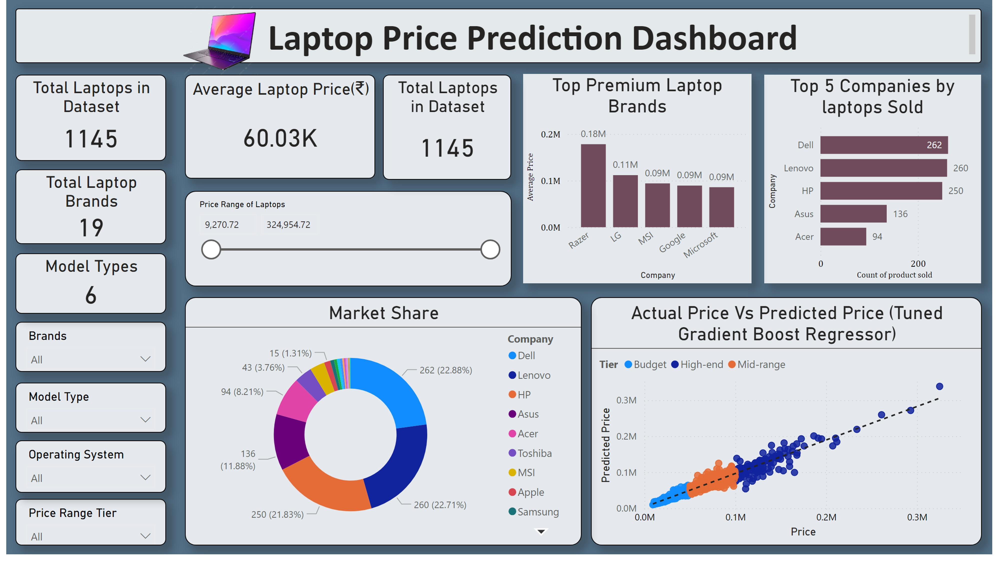
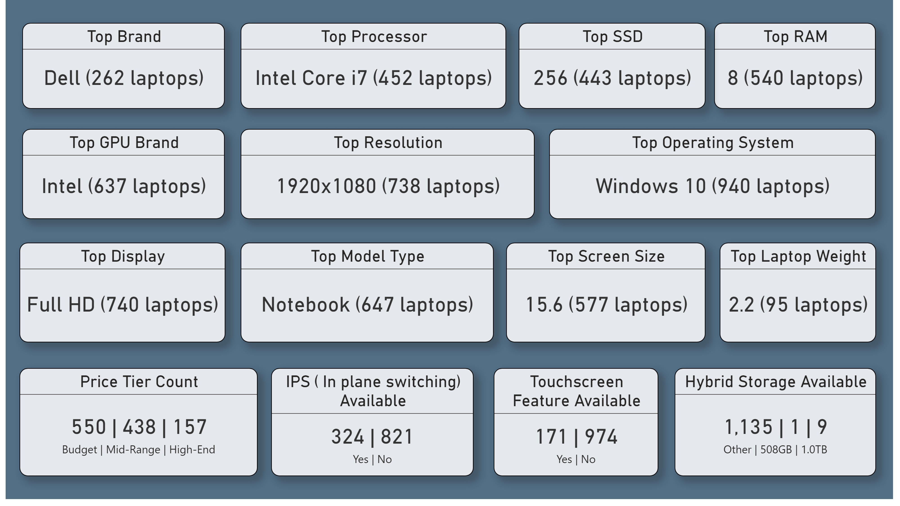
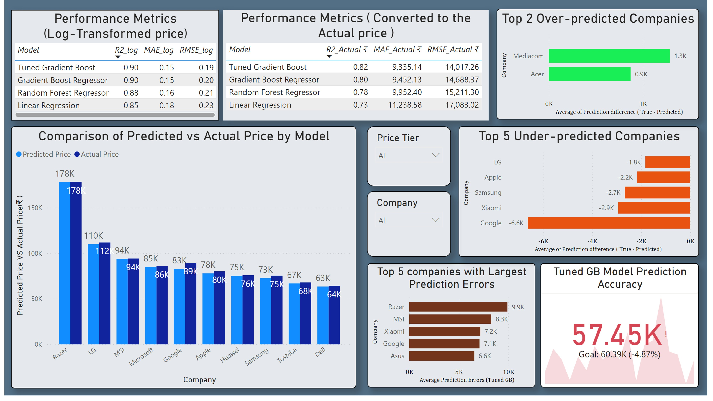

# 💻 Capstone Project 2: Laptop Price Prediction using Machine Learning (Python) & Power BI  

---

## 📘 Overview  
This project focuses on predicting **laptop prices** using **Machine Learning** techniques in **Python**, complemented by an **interactive Power BI dashboard** for insightful visual analysis.  

The objective is to build a predictive model capable of estimating laptop prices based on technical specifications such as Company, model type, Inches, ScreenResolution, Cpu, Ram, Memory, Gpu, OpSys, Weight, Price  
The project concludes with a business-ready Power BI dashboard and presentation summarizing key findings.  

---

## 📊 Dataset  
- **Source:** Publicly available dataset (e.g., Kaggle or web-scraped data).  
- **Description:** The dataset includes specifications of laptops with features such as:  
  - Unnamed: 0.1, Unnamed: 0, Company, model type, Inches, ScreenResolution, Cpu, Ram, Memory, Gpu, OpSys, Weight, Price( feature variable) 
  - Price (Target Variable)  

---

## 🧰 Tools & Technologies  
| Category | Tools Used |
|-----------|-------------|
| **Programming Language** | Python |
| **Libraries** | pandas, numpy, matplotlib, seaborn, scikit-learn |
| **Visualization** | Power BI |
| **Presentation** | Microsoft PowerPoint |
| **IDE** | colab/ Jupyter Notebook  |

---

## 🔍 Project Workflow  

### 1️⃣ Data Importing  
- Loaded the dataset using `pandas`.  
- Reviewed data structure, types, and missing values.  

### 2️⃣ Data Preprocessing  
- Handled missing values, duplicates, and outliers.  
- Encoded categorical variables.  
- Normalized numerical features for consistent scaling.
- Removed redundant or non-informative columns.  

### 4️⃣ Exploratory Data Analysis (EDA)  
- Visualized data trends and correlations.  
- Identified key variables influencing laptop prices.  
- Used heatmaps, histograms, and pairplots for pattern discovery.

### 3️⃣ Feature Selection
- Selecting relevent feature columns for modelling
- Log transformed Price column used

### 5️⃣ Model Development  
- Split data into training and test sets.  
- Implemented models including **Linear Regression**, **Random Forest**, **Gradient Boost** and **XGBoost**.  
- Evaluated models using metrics like **RMSE**, **R²**, and **MAE**.  

### 6️⃣ Hyperparameter Tuning  
- Used **RandomizedSearchCV** for model optimization.  
- Selected the best-performing model for final deployment.  

### 7️⃣ Real-Time Predictions  
- Built a interactive prediction function to estimate laptop prices from user input.  

### 8️⃣ Power BI Dashboard  
- Imported cleaned dataset into Power BI.  
- Designed interactive visuals and filters for:  
  -  Overview
  - Most preffered features
  - Model performance
- Developed an executive summary for business stakeholders. (Overview)

---

## 📈 Results & Insights  
- Achieved accurate laptop price predictions with a robust model.  
- Identified **top predictors**: RAM, Screen Resolution (X_res, Y_res), and SSD capacity.  
- Created a **dynamic Power BI dashboard** showcasing data trends and KPIs.  
- Compiled results and visuals into a **Capstone_project2_ppt**.  

---

## 📊 Power BI Dashboard Preview   

---

## 🚀 Key Insights

- Brand Influence: Dell, Lenovo, and HP dominate in purchase volume, while Razer, LG, and MSI produce the most premium laptops with higher price points.
- Type of Laptop: Notebooks dominate sales, followed by Ultrabooks and Gaming laptops. Gaming laptops and workstations are the most expensive due to higher specs.
- Operating System: Windows 10 is the most popular OS but has minimal impact on price; pricing is driven mainly by hardware specs.
- Processor: Intel Core i7 laptops occupy the premium range, while models with Intel Core i3 or AMD processors are among the most affordable.
- Display Quality: Display quality strongly impacts price. 4K Ultra HD Retina and Quad HD+ displays are premium, while Full HD and lower resolutions are more common and more affordable.
- Screen Technology: IPS displays and touchscreen features are popular and associated with higher price points.
- Weight and Price: Weight does not directly correlate with price; however, higher-spec models tend to weigh more (typically >3.0 kg).
- Resolution and Size: Higher screen resolutions and larger screen sizes correlate positively with price. Most buyers prefer around a 14-inch medium sized screen as well as medium resolutions considering the affordability.
- RAM: Strong positive correlation between RAM size and price; 8 GB RAM is the most common among buyers. This is a major driver of price.
- GPU: Laptops mostly feature Intel GPUs; Nvidia GPUs are premium and increase cost due to better performance.
- Storage:  SSD and hybrid storage moderately impact price, while HDD and flash storage have minimal influence.

*Final Insight: RAM, Screen Resolution (X_res, Y_res), and SSD capacity emerged as the top predictors of laptop price.*
